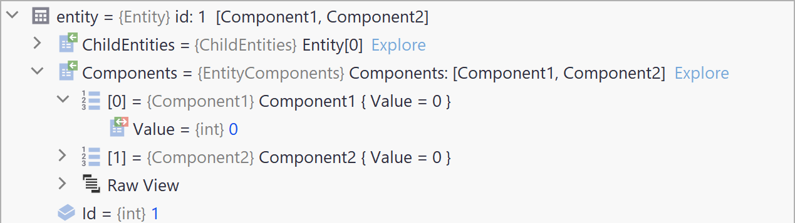

[](https://github.com/friflo/ECS.CSharp.Benchmark-common-use-cases/actions/workflows/benchmark-ci.yml)
[](https://github.com/friflo/ECS.CSharp.Benchmark-common-use-cases/tree/main/results/mac-mini-m2)

# ECS.CSharp.Benchmark - Common use-cases

Motivation of this benchmark project:

- Compare performance of common uses cases of multiple ECS projects.  
  *"I want to compare the performance of two C# ECS projects"?*  
  Use the example command shown in the [Benchmark CLI](#benchmark-cli) examples below.

- Utilize a common ECS operation of a specific ECS project in most **simple & performant** way.  

- *"I want to migrate from one C# ECS to another"?*  
  Navigate to a specific benchmark in both projects an use their implementations as migration guide.  
  Benchmark implementations are intended to be as simple as possible.

- Having an alternative to the popular [Ecs.CSharp.Benchmark](https://github.com/Doraku/Ecs.CSharp.Benchmark).  
  As the mentioned project is currently not active maintained.

See comments about this benchmark at [reddit announcement post](https://www.reddit.com/r/EntityComponentSystem/comments/1e0qo62/just_published_new_github_repo_ecs_c_benchmark/)


# Contents

* [Tested projects](#tested-projects)
* [ECS implementation](#ecs-implementation)
* [Benchmarks](#benchmarks)
  - [Overview](#overview)
  - [Basic](#basic)
  - [Relations](#relations)
  - [Command buffer](#command-buffer)
  - [Events](#events)
  - [Search](#search)
* [Setup](#setup)
* [Contribution](#contribution)
* [Benchmark CLI](#benchmark-cli)
* [Other C# ECS Benchmarks](#other-c-ecs-benchmarks)


<br/>

## Tested projects

- [x] All tested projects are engine agnostic.  
- [x] 🔒 **C#** - dll uses only *verifiable safe code*. This allows execution in trusted environments.  
      See [Unsafe code ⋅ Microsoft](https://learn.microsoft.com/en-us/dotnet/csharp/language-reference/unsafe-code) and
      [C# Language specification  ⋅ Microsoft](https://learn.microsoft.com/en-us/dotnet/csharp/language-reference/language-specification/unsafe-code)
      using `<AllowUnsafeBlocks>`.

*Projects ordered by dll size*  
| ECS                                                                       | ECS type    | Entity  | 🔒 C# | size kb |            tested | nuget latest
|-------------------------------------------------------------------------- | ----------- | ------- |:-----:| -------:| -----------------:| --------------------------------------
| [Leopotam.EcsLite](https://github.com/Leopotam/ecslite)                   | Sparse Set  | int     |  ✅   |      18 |             1.0.1 | [](https://www.nuget.org/packages/Leopotam.EcsLite) ⁽¹⁾
| [Morpeh](https://github.com/scellecs/morpeh)                              | ?           | class   |       |      76 |          2023.1.0 | [](https://www.nuget.org/packages/Scellecs.Morpeh)
| [fennecs](https://github.com/outfox/fennecs)                              | Archetype   | struct  |       |     157 |       0.5.10-beta | [](https://www.nuget.org/packages/fennecs)
| [DefaultEcs](https://github.com/Doraku/DefaultEcs)                        | Sparse Set  | struct  |       |     169 |     0.18.0-beta01 | [](https://www.nuget.org/packages/DefaultEcs)
| [Friflo.Engine.ECS](https://github.com/friflo/Friflo.Engine.ECS)          | Archetype   | struct  |  ✅  |     307  |  3.0.0-preview.10 | [](https://www.nuget.org/packages/Friflo.Engine.ECS)
| [Friflo.Engine.ECS.Boost](https://github.com/friflo/Friflo.Engine.ECS)    | 📦         |         |       |     +12 |  3.0.0-preview.10 | [](https://www.nuget.org/packages/Friflo.Engine.ECS.Boost)
| [TinyEcs](https://github.com/andreakarasho/TinyEcs)                       | Archetype   | struct  |       |     487 |             1.4.0 | [](https://www.nuget.org/packages/TinyEcs.Main)
| [Myriad.ECS](https://github.com/martindevans/Myriad.ECS)                  | Archetype   | struct  |       |     631 |            21.2.1 | [](https://www.nuget.org/packages/Myriad.ECS)
| [Arch](https://github.com/genaray/Arch)                                   | Archetype   | struct  |       |     765 |             1.2.8 | [](https://www.nuget.org/packages/Arch)
| [Arch.Relationships](https://github.com/genaray/Arch.Extended)            | 📦         |         |  ✅  |      +9  |             1.0.1 | [](https://www.nuget.org/packages/Arch.Relationships)
| [Flecs.NET](https://github.com/BeanCheeseBurrito/Flecs.NET)               | Arch/Sparse | struct  |       |    1600 |             4.0.0 | [](https://www.nuget.org/packages/Flecs.NET.Release)

⁽¹⁾ nuget package not published by project owner  


## ECS implementation

The are typically two types used by many ECS projects

### Archetype

Entities are stored in single array. Components as stored in "tables" aka Archetypes.  
An Archetype contains arrays of components for a specific set of component types.

**Pros:** Enable fast iteration of component queries.  
**Cons**: Add/remove operations require a structural change.  

### Sparse Set

A sparse Set based ECS stores each component in its own sparse set which is has the entity id as key.

**Pros:** Fast add/remove operations.  
**Cons:** Each component type requires an array with the size of all components.  

<br/>


# Benchmarks

## Feature Matrix

- [x] **Watch** - Watch / navigate entity components ad-hoc in debugger.
    <details>    
        <summary>See example screenshot</summary>
                
    </details>

| ECS                  | Basic | Relations | Command Buffer | Events | Search | Watch  |
|--------------------- | ----- | --------- | -------------- | ------ | ------ | ------ |
| Arch + Relationships |  ✅  |  ✅       |  ✅           |  [^1]  |         |  ✅   |
| DefaultEcs           |  ✅  |           |  ✅            |  ✅    |        |  ✅   |
| fennecs              |  ✅  |  ✅       |                |  [^2]  |        |  ✅   |
| Flecs.NET            |  ✅  |  ✅       |  ✅           |   ✅   |        |        |
| Friflo.Engine.ECS    |  ✅  |  ✅ ¹     |  ✅           |   ✅   |   ✅   |  ✅   |
| Leopotam.EcsLite     |  ✅  |           |                |         |        |       |
| Morpeh               |  ✅  |           |  ✅            |        |        |        |
| Myriad.ECS           |  ✅  |           |  ✅            |        |        |        |
| TinyEcs              |  ✅  |  ✅       |  ✅           |   ✅   |        |        |

¹ Ensures a cycle free entity hierarchy. See [CheckTreeCycles()](https://github.com/search?q=repo%3Afriflo%2FECS.CSharp.Benchmark-common-use-cases+CheckTreeCycles&type=code)

<br/>

| Benchmark Description                                         | Category                  |
|-------------------------------------------------------------- | ------------------------- |
| [**Basic**](#basic)                                           |                           |
| Add & Remove 1/5 components on 100 entities                   | `AddRemoveComponents`     |
| Create 100 entities with 1/3 components                       | `CreateEntity`            |
| Create World                                                  | `CreateWorld`             |
| Delete 100.000 entities with 5 components                     | `DeleteEntity`            |
| Get & Set 1 / 5 components on 100 entities                    | `GetSetComponents`        |
| Query 100 / 100.000 entities with 1 / 5 components            | `QueryComponents`         |
|                                                               |                           |
| [**Relations**](#relations)                                   |                           |
| Add & Remove 1/100 link relation on 100 entities              | `AddRemoveLinks`          |
| Add & Remove 1/10 relations on 100 entities                   | `AddRemoveRelations`      |
| Add & Remove 10 child entities on 100 parent entities         | `ChildEntitiesAddRemove`  |
|                                                               |                           |
| [**Command Buffer**](#command-buffer) - *deferred operations* |                           |
| Add & Remove 2 components on 100 entities                     | `CommandBufferAddRemove`  |
|                                                               |                           |
| [**Events**](#events) - *reactive ECS*                        |                           |
| Get event callback on Add & Remove 1 component                | `ComponentEvents`         |
|                                                               |                           |
| [**Search**](#search)                                         |                           |
| Search component field in 1.000.000 entities                  | `SearchComponentField`    |
| Search range of component fields in 1.000.000 entities        | `SearchRange`             |

<br/>

Run benchmarks always on an **Apple Mac Mini M2**.  
Its hardware specs are fixed and can be compared with benchmarks you run by your own on this machine.

```
BenchmarkDotNet v0.13.12, macOS Sonoma 14.5 (23F79) [Darwin 23.5.0]
Apple M2, 1 CPU, 8 logical and 8 physical cores
.NET SDK 8.0.100
  [Host]   : .NET 8.0.0 (8.0.23.53103), Arm64 RyuJIT AdvSIMD
  ShortRun : .NET 8.0.0 (8.0.23.53103), Arm64 RyuJIT AdvSIMD
```


## Overview

Readme benchmark update: **2024-08-09** using this
[run](https://github.com/friflo/ECS.CSharp.Benchmark-common-use-cases/blob/main/results/mac-mini-m2/all/BenchmarkRun-joined-2024-08-08-18-23-57-report-github.md)

*Ratio*: Average Performance Ratio - see [C# ECS Benchmark Overview ⋅ Google Sheets](https://docs.google.com/spreadsheets/d/1170ZjOXhiQJpY-VuNxocxaxPKGTJYQL72Zcbrvq0CcY) 

|         |     friflo | Flecs.NET  | TinyEcs    | Arch       | fennecs    | Leopotam   | DefaultEcs | Morpeh     |
| ------- | ----------:| ----------:| ----------:| ----------:| ----------:| ----------:| ----------:| ----------:|
| *Ratio* |       1.00 |       2.55 |       3.42 |       6.96 |      19.02 |       2.57 |       3.81 |      21.09 |
| *Notes* |            |            |            |            |            | [^sparse]  | [^sparse]  | [^sparse]  |

[^sparse]: Sparse Set based ECS projects.

## **Basic**

### Add & Remove 1 / 5 component on 100 entities

**Note:** See impact of structural changes in Archetype based ECS projects.  

| Namespace         | Entities | Components | Mean          | Ratio    | Allocated  | 
|------------------ |--------- |----------- |--------------:|---------:|-----------:|
| Leopotam.EcsLite  | 100      | 1          |        981 ns |     0.17 |          - | 
| DefaultEcs        | 100      | 1          |      1,431 ns |     0.25 |          - | 
| Scellecs.Morpeh   | 100      | 1          |      1,676 ns |     0.29 |          - | 
| Flecs.NET         | 100      | 1          |      3,761 ns |     0.65 |          - | 
| TinyEcs           | 100      | 1          |      3,984 ns |     0.69 |          - | 
| Friflo.Engine.ECS | 100      | 1          |      5,787 ns |     1.00 |          - | 
| Arch              | 100      | 1          |      8,438 ns |     1.46 |    12000 B | 
| Myriad            | 100      | 1          |     19,044 ns |     3.29 |          - | 
| fennecs           | 100      | 1          |     38,594 ns |     6.67 |    86400 B | 
|                   |          |            |               |          |            | 
| Scellecs.Morpeh   | 100      | 5          |      4,988 ns |     0.64 |          - | 
| Leopotam.EcsLite  | 100      | 5          |      5,118 ns |     0.66 |          - | 
| DefaultEcs        | 100      | 5          |      7,120 ns |     0.92 |          - | 
| Friflo.Engine.ECS | 100      | 5          |      7,779 ns |     1.00 |          - | 
| Arch              | 100      | 5          |     23,106 ns |     2.97 |     8800 B | 
| TinyEcs           | 100      | 5          |     29,867 ns |     3.84 |          - | 
| Flecs.NET         | 100      | 5          |     37,030 ns |     4.76 |          - | 
| Myriad            | 100      | 5          |     54,960 ns |     7.06 |          - | 
| fennecs           | 100      | 5          |    307,458 ns |    39.52 |   620800 B | 


### Create 100 entities with 1 / 3 components

| Namespace         | Entities | Components | Mean          | Ratio    | Allocated  | 
|------------------ |--------- |----------- |--------------:|---------:|-----------:|
| Leopotam.EcsLite  | 100      | 1          |      1,374 ns |     0.30 |     7048 B | 
| DefaultEcs        | 100      | 1          |      3,894 ns |     0.85 |    12960 B | 
| Friflo.Engine.ECS | 100      | 1          |      4,574 ns |     1.00 |    11600 B | 
| TinyEcs           | 100      | 1          |      5,536 ns |     1.22 |    86264 B | 
| Arch              | 100      | 1          |      7,948 ns |     1.74 |    36400 B | 
| Flecs.NET         | 100      | 1          |      8,558 ns |     1.87 |      736 B | 
| Myriad            | 100      | 1          |     11,178 ns |     2.45 |    18936 B | 
| Scellecs.Morpeh   | 100      | 1          |     13,511 ns |     2.99 |    42896 B | 
| fennecs           | 100      | 1          |     37,324 ns |     8.22 |   252376 B | 
|                   |          |            |               |          |            | 
| Leopotam.EcsLite  | 100      | 3          |      3,163 ns |     0.82 |    19672 B | 
| Friflo.Engine.ECS | 100      | 3          |      3,877 ns |     1.00 |    15856 B | 
| Arch              | 100      | 3          |      6,384 ns |     1.65 |    28256 B | 
| DefaultEcs        | 100      | 3          |      7,615 ns |     1.95 |    23368 B | 
| TinyEcs           | 100      | 3          |      8,953 ns |     2.31 |   121896 B | 
| Scellecs.Morpeh   | 100      | 3          |     16,683 ns |     4.28 |    54400 B | 
| Flecs.NET         | 100      | 3          |     17,391 ns |     4.55 |      736 B | 
| Myriad            | 100      | 3          |     21,014 ns |     5.39 |    27288 B | 
| fennecs           | 100      | 3          |    103,193 ns |    26.41 |   395856 B | 

Some frameworks support **bulk creation** of entities.  
If available bulk creation is faster than the approach creating entities ony by one.

| Namespace         | Entities | Components | Mean          | Ratio    | Allocated  | 
|------------------ |--------- |----------- |--------------:|---------:|-----------:|
| Friflo.Engine.ECS | 100      | 1          |        988 ns |     1.00 |     7856 B | 
| Arch              | 100      | 1          |      7,360 ns |     7.53 |    36736 B | 
| fennecs           | 100      | 1          |     19,065 ns |    19.48 |   210712 B | 
|                   |          |            |               |          |            | 
| Friflo.Engine.ECS | 100      | 3          |      1,605 ns |     1.00 |    12112 B | 
| Arch              | 100      | 3          |      7,906 ns |     4.88 |    28592 B | 
| fennecs           | 100      | 3          |     25,458 ns |    15.74 |   214448 B | 


### Create World

| Namespace         | Mean          | Ratio    | Allocated  | 
|------------------ |--------------:|---------:|-----------:|
| DefaultEcs        |         74 ns |     0.31 |      336 B | 
| Friflo.Engine.ECS |        238 ns |     1.00 |     3952 B | 
| Myriad            |        802 ns |     3.36 |    19776 B | 
| Leopotam.EcsLite  |      1,443 ns |     6.04 |    58944 B | 
| Arch              |      3,369 ns |    14.11 |    37040 B | 
| Scellecs.Morpeh   |      4,295 ns |    17.98 |     5056 B | 
| fennecs           |     21,295 ns |    89.16 |   169364 B | 
| TinyEcs           |     51,588 ns |   215.98 |  1312184 B | 
| Flecs.NET         |  1,033,699 ns | 4,265.55 |     1009 B | 


### Delete 100.000 entities with 5 components

| Namespace         | Entities | Components | Mean          | Ratio    | Allocated  | 
|------------------ |--------- |----------- |--------------:|---------:|-----------:|
| Friflo.Engine.ECS | 100000   | 5          |  1,590,691 ns |     1.00 |      736 B | 
| Myriad            | 100000   | 5          |  1,917,754 ns |     1.20 |  4196080 B | 
| Flecs.NET         | 100000   | 5          |  1,985,879 ns |     1.25 |      736 B | 
| Arch              | 100000   | 5          |  2,899,945 ns |     1.73 |     3088 B | 
| TinyEcs           | 100000   | 5          |  3,382,786 ns |     2.13 |     1480 B | 
| DefaultEcs        | 100000   | 5          |  3,684,181 ns |     2.31 |  3200736 B | 
| Leopotam.EcsLite  | 100000   | 5          |  4,814,687 ns |     3.03 |  6268768 B | 
| fennecs           | 100000   | 5          |  5,720,832 ns |     3.60 |  4366912 B | 
| Scellecs.Morpeh   | 100000   | 5          |  8,842,465 ns |     5.55 |  1398360 B | 


### Get & Set 1 / 5 component on 100 entities

**Note:** Sparse Set based ECS projects are in lead because of viewer array lookups.

| Namespace         | Entities | Components | Mean          | Ratio    | Allocated  | 
|------------------ |--------- |----------- |--------------:|---------:|-----------:|
| Leopotam.EcsLite  | 100      | 1          |         65 ns |     0.32 |          - | 
| DefaultEcs        | 100      | 1          |        115 ns |     0.57 |          - | 
| Scellecs.Morpeh   | 100      | 1          |        141 ns |     0.70 |          - | 
| Friflo.Engine.ECS | 100      | 1          |        202 ns |     1.00 |          - | 
| Arch              | 100      | 1          |        288 ns |     1.42 |          - | 
| Myriad            | 100      | 1          |        346 ns |     1.71 |          - | 
| Flecs.NET         | 100      | 1          |        582 ns |     2.87 |          - | 
| TinyEcs           | 100      | 1          |        729 ns |     3.60 |          - | 
| fennecs           | 100      | 1          |      2,369 ns |    11.68 |          - | 
|                   |          |            |               |          |            | 
| Leopotam.EcsLite  | 100      | 5          |        312 ns |     0.76 |          - | 
| Friflo.Engine.ECS | 100      | 5          |        410 ns |     1.00 |          - | 
| DefaultEcs        | 100      | 5          |        457 ns |     1.11 |          - | 
| Scellecs.Morpeh   | 100      | 5          |        614 ns |     1.50 |          - | 
| Arch              | 100      | 5          |      1,586 ns |     3.86 |          - | 
| Myriad            | 100      | 5          |      1,744 ns |     4.24 |          - | 
| Flecs.NET         | 100      | 5          |      2,690 ns |     6.55 |          - | 
| TinyEcs           | 100      | 5          |      4,004 ns |     9.74 |          - | 
| fennecs           | 100      | 5          |     14,345 ns |    34.91 |          - | 


### Query 100 / 100.000 entities with 1 / 5 components

**Note:** Archetype based ECS projects are in lead if querying multiple components.  
Returned components are sequentially stored in memory providing a high cache hit rate.

| Namespace         | Entities | Components | Mean          | Ratio    | Allocated  | 
|------------------ |--------- |----------- |--------------:|---------:|-----------:|
| DefaultEcs        | 100      | 1          |         44 ns |     0.86 |          - | 
| Friflo.Engine.ECS | 100      | 1          |         51 ns |     1.00 |          - | 
| Myriad            | 100      | 1          |         65 ns |     1.28 |          - | 
| TinyEcs           | 100      | 1          |         67 ns |     1.32 |          - | 
| Leopotam.EcsLite  | 100      | 1          |         77 ns |     1.51 |          - | 
| Flecs.NET         | 100      | 1          |        141 ns |     2.75 |          - | 
| fennecs           | 100      | 1          |        203 ns |     3.97 |       88 B | 
| Arch              | 100      | 1          |        299 ns |     5.84 |          - | 
| Scellecs.Morpeh   | 100      | 1          |        374 ns |     7.30 |          - | 
|                   |          |            |               |          |            | 
| Friflo.Engine.ECS | 100      | 5          |         65 ns |     1.00 |          - | 
| Myriad            | 100      | 5          |         71 ns |     1.09 |          - | 
| TinyEcs           | 100      | 5          |        127 ns |     1.95 |          - | 
| Flecs.NET         | 100      | 5          |        200 ns |     3.07 |          - | 
| DefaultEcs        | 100      | 5          |        272 ns |     4.17 |          - | 
| Leopotam.EcsLite  | 100      | 5          |        340 ns |     5.21 |          - | 
| Arch              | 100      | 5          |        341 ns |     5.22 |          - | 
| fennecs           | 100      | 5          |        441 ns |     6.76 |       88 B | 
| Scellecs.Morpeh   | 100      | 5          |        782 ns |    11.99 |          - | 
|                   |          |            |               |          |            | 
| DefaultEcs        | 100000   | 1          |     45,890 ns |     0.94 |          - | 
| Friflo.Engine.ECS | 100000   | 1          |     48,631 ns |     1.00 |          - | 
| fennecs           | 100000   | 1          |     49,366 ns |     1.02 |       88 B | 
| Flecs.NET         | 100000   | 1          |     49,899 ns |     1.03 |          - | 
| TinyEcs           | 100000   | 1          |     50,214 ns |     1.03 |          - | 
| Myriad            | 100000   | 1          |     51,355 ns |     1.06 |          - | 
| Leopotam.EcsLite  | 100000   | 1          |     77,551 ns |     1.60 |          - | 
| Arch              | 100000   | 1          |    211,165 ns |     4.34 |          - | 
| Scellecs.Morpeh   | 100000   | 1          |    855,866 ns |    17.60 |        1 B | 
|                   |          |            |               |          |            | 
| Friflo.Engine.ECS | 100000   | 5          |     48,055 ns |     1.00 |          - | 
| Myriad            | 100000   | 5          |     56,872 ns |     1.18 |          - | 
| Flecs.NET         | 100000   | 5          |     77,777 ns |     1.62 |          - | 
| TinyEcs           | 100000   | 5          |     89,260 ns |     1.86 |          - | 
| fennecs           | 100000   | 5          |    108,646 ns |     2.26 |       88 B | 
| Arch              | 100000   | 5          |    229,269 ns |     4.77 |          - | 
| DefaultEcs        | 100000   | 5          |    318,011 ns |     6.62 |          - | 
| Leopotam.EcsLite  | 100000   | 5          |    350,145 ns |     7.29 |          - | 
| Scellecs.Morpeh   | 100000   | 5          |  1,979,985 ns |    41.20 |        1 B | 


#### Query performance comparison: C++ vs C#

Performance reference [vanilla C++ implementation](docs/query-components-bench.cpp)

| OS      | CPU | Lang. | Impl.             | Entities | Components | Mean          |
|-------- | --- | ----- | ----------------- |--------- |----------- |--------------:|
| macOS   | M2  | C++   | vanilla           | 100000   | 5          |     20,557 ns |
| macOS   | M2  | C#    | Friflo.Engine.ECS | 100000   | 5          |     48,055 ns |
| Windows | x64 | C++   | vanilla           | 100000   | 5          |     58,430 ns |
| Windows | x64 | C#    | Friflo.Engine.ECS | 100000   | 5          |     79,058 ns |

<br/>


## **Relations**

Some ECS projects have support for [Entity Relationships](https://friflo.gitbook.io/friflo.engine.ecs/examples/component-types#entity-relationships).  
Compared to relational databases: Entity relationships are similar to foreign keys referencing primary keys in other tables.
ECS implementations typically ensure [referential integrity](https://en.wikipedia.org/wiki/Referential_integrity).
This means there are never links to entities which doesn't exist.

Relations enable *directed* links between entities aka entity relationships.  
*Directed link* means that a link points from a source entity to a target entity.  
A single entity can have multiple links to other target entities.

### Add & Remove 1 / 100 link relations on 100 entities

| Namespace         | Entities | Relations | Mean          | Ratio    | Allocated  | 
|------------------ |--------- |---------- |--------------:|---------:|-----------:|
| Friflo.Engine.ECS | 100      | 1         |      5,912 ns |     1.00 |          - | 
| Flecs.NET         | 100      | 1         |     10,552 ns |     1.78 |          - | 
| TinyEcs           | 100      | 1         |     15,864 ns |     2.68 |          - | 
| Arch              | 100      | 1         |     72,628 ns |    12.28 |    36800 B | 
| fennecs           | 100      | 1         |     94,414 ns |    15.97 |   180000 B | 
|                   |          |           |               |          |            | 
| Flecs.NET         | 100      | 100       |    976,119 ns |     0.78 |        1 B | 
| Friflo.Engine.ECS | 100      | 100       |  1,252,632 ns |     1.00 |        1 B | 
| Arch              | 100      | 100       |  4,353,920 ns |     3.48 |  2180006 B | 
| TinyEcs           | 100      | 100       |  4,694,910 ns |     3.75 |        8 B | 
| fennecs           | 100      | 100       | 71,847,234 ns |    57.35 | 93124905 B | 

<br/>

When dealing with an ECS following question arises at some point:  
*"Is it okay for performance to use an array, List<> or Dictionary<> as a component field"?*  
No, its not 😲. Now each component has a one or more reference types.  
As a result there is no cache locality anymore and GC requires much more CPU & memory resources.  
This is the reason why many ECS projects have relations.

A typical limitation of an ECS is that an entity can only contain one component of a certain type.  
Relations can be used to **add multiple components of the same type** to a single entity.  
To differentiate relations added to the same entity following mechanisms are used:

- **Friflo.Engine.ECS**         - A component field is used as discriminator specified in `IRelationComponent<TKey>`.
- **Flecs.NET** & **TinyEcs**   - Tags are used as discriminator.
- **Arch.Relationships**        - An additional entity with a component is used as discriminator.
- **fennecs**                   - Reference type instances are used as discriminator.

### Add & Remove 1 / 100 relations on 100 entities

| Namespace         | Entities | Relations | Mean          | Ratio    | Allocated  | 
|------------------ |--------- |---------- |--------------:|---------:|-----------:|
| Friflo.Engine.ECS | 100      | 1         |      3,761 ns |     1.00 |          - | 
| Flecs.NET         | 100      | 1         |     12,266 ns |     3.26 |          - | 
| TinyEcs           | 100      | 1         |     23,416 ns |     6.22 |          - | 
| Arch              | 100      | 1         |     48,360 ns |    12.86 |    36800 B | 
| fennecs           | 100      | 1         |     96,676 ns |    25.71 |   180000 B | 
|                   |          |           |               |          |            | 
| Friflo.Engine.ECS | 100      | 10        |     47,569 ns |     1.00 |          - | 
| Flecs.NET         | 100      | 10        |    158,925 ns |     3.34 |          - | 
| Arch              | 100      | 10        |    204,024 ns |     4.29 |   240800 B | 
| TinyEcs           | 100      | 10        |    282,603 ns |     5.94 |        1 B | 
| fennecs           | 100      | 10        |  1,578,632 ns |    33.20 |  2568001 B | 


### Add & Remove 10 child entities on 100 parent entities

Child / parent entity relationships are used to build a hierarchy / tree of entities.  
It is, among other things, a use case for scene trees, entity parenting or character rig skeletons.

| Namespace         | Entities | Mean          | Ratio    | Allocated  | 
|------------------ |--------- |--------------:|---------:|-----------:|
| Friflo.Engine.ECS | 100      |     25,754 ns |     1.00 |          - | 
| Flecs.NET         | 100      |     94,588 ns |     3.67 |          - | 
| TinyEcs           | 100      |    191,267 ns |     7.43 |          - | 
| Arch              | 100      |    433,217 ns |    16.82 |   232801 B | 
| fennecs           | 100      |    929,259 ns |    36.08 |  1800001 B | 

<br/>


## **Command buffer**

A command buffer is used to record entity changes in a buffer.  
While recording the state of entities remains unchanged.  
These changes are applied to these entities when calling either   
`Playback()`, `Execute()`, `Commit()` or `DeferEnd()`

### Add & Remove 2 components on 100 entities using a command buffer

1. Add components.    Apply changes.
2. Remove components. Apply changes.

| Namespace         | Entities | Mean          | Ratio    | Allocated  | 
|------------------ |--------- |--------------:|---------:|-----------:|
| Scellecs.Morpeh   | 100      |      5,020 ns |     0.58 |          - | 
| Friflo.Engine.ECS | 100      |      8,665 ns |     1.00 |          - | 
| TinyEcs           | 100      |     12,907 ns |     1.49 |     4800 B | 
| Flecs.NET         | 100      |     14,344 ns |     1.65 |          - | 
| DefaultEcs        | 100      |     16,319 ns |     1.88 |          - | 
| Myriad            | 100      |     27,799 ns |     3.21 |          - | 
| Arch              | 100      |     48,811 ns |     5.63 |     4800 B | 

<br/>


## **Events**

ECS implementations supporting callbacks for specific events are called **reactive**.  
Typical event types are:
- Add / Update / Remove component
- Add / Remove tag
- Create / Delete entity

### Get callback event on Add & Remove 1 component on 100 entities

| Namespace         | Entities | Mean          | Ratio    | Allocated  | 
|------------------ |--------- |--------------:|---------:|-----------:|
| DefaultEcs        | 100      |      2,605 ns |     0.33 |          - | 
| TinyEcs           | 100      |      4,395 ns |     0.56 |          - | 
| Friflo.Engine.ECS | 100      |      7,905 ns |     1.00 |          - | 
| Flecs.NET         | 100      |     11,251 ns |     1.42 |          - | 

[^1]:  Arch: Support for events requires a custom build. Performance of component related benchmarks will decrease.
[^2]:  fennecs: Support for events is planned according to its project README.

<br/>


## **Search**

A search can be used to get all entities with a specific component field value.  
This type of search is typically executed in O(1) .  
E.g. to find all entities having a `Player` component where `Player.name == "Bob"`
```
struct Player { string name; } 
```

A search can also be used for range queries to find all entities with a component field value in a [min, max] range.  
E.g. a range query return all entities with a `Health` component where `Health.value` is between 10 and 100.
```
struct Health { int value; } 
```

Search and Range Queries of component fields are explained at this [Wiki](https://friflo.gitbook.io/friflo.engine.ecs/examples/component-types#search).

### Search component field in 1.000.000 entities

Execute 1000 searches for different search values in a data set of 1.000.000 entities.  
Each result has 1 match.

| Namespace         | Entities | Mean          | Ratio    | Allocated  | 
|------------------ |--------- |--------------:|---------:|-----------:|
| Friflo.Engine.ECS | 1000000  |      4,745 ns |     1.00 |          - | 

### Search range of component fields in 1.000.000 entities

Execute 1000 range queries with different [min, max] in a data set of 1.000.000 entities.  
Each result has 100 matches.

| Namespace         | Entities | Mean          | Ratio    | Allocated  | 
|------------------ |--------- |--------------:|---------:|-----------:|
| Friflo.Engine.ECS | 1000000  |  1,512,413 ns |     1.00 |   560001 B | 

<br/>


# Setup

The benchmark project can be build and executed on **Windows**, **macOS** & **Linux**.  
All popular IDE's can be used to run and debug the project: **Rider**, **Visual Studio Code** & **Visual Studio**.

**Benchmark constraints**

- Each benchmark is **simple** and uses the fastest single threaded variant available.  
  To obtain clarity a project must not have multiple variants of the same benchmark type.
- A ECS framework must implement all [Basic](#basic) benchmarks. Reasons  
  - Operations used in basic benchmarks are required to build a rudimentary application.
  - Avoid cherry picking of benchmarks with good performance.
- Each Benchmark shares no state or code with any other benchmarks.
- Adding or removing a benchmark implementation has no effect on all others.
- Each project has an extension class `BenchUtils` with two methods to used by its benchmarks.  
  `BenchUtils.CreateEntities(int count)`  
  `BenchUtils.AddComponents(this Entity[] entities)`
- A package of the ECS must be available on nuget.
- The Project builds with `<AllowUnsafeBlocks>false</AllowUnsafeBlocks>`. See [ECS.Benchmark.csproj](src/ECS.Benchmark.csproj).

The benchmarks `CreateEntity` and `DeleteEntity` are changing the state of World which has influence on the benchmark measurement.  
If executing their `[Benchmark]` method multiple times the number of entities will grow / shrink for each method iteration.  
This would slow down the execution over time and give wrong measurement results.  
To avoid this these benchmarks are executed with 100.000 entities every time on a new World instance.


# Contribution

Contributions are welcome.  
Only requirement: Ensure it compiles.

- *How to add a single benchmark*?  
  Copy an existing benchmark and make adaptations.

- *How to add benchmarks for a new ECS project*?  
  Copy an existing project and make adaptations.

- *Adding a new benchmark category*?  
  Open a new issue or discussion to explain the feature.


# Benchmark CLI

Currently ~ 100 benchmarks

- Running all benchmarks                    ~ 40 minutes
- Running all benchmarks with `--job Short` ~ 10 minutes
- Running all benchmarks with `--job Dry`   ~  1 minute (used by CI)

The published benchmarks are executed without: `--job` argument.  
The measurement difference when using `--job Short` were 2x in some benchmarks.  

For documentation of `--job` argument see [BenchmarkDotNet CLI args](https://github.com/dotnet/BenchmarkDotNet/blob/master/docs/articles/guides/console-args.md#more)

### Windows CLI

```php
cd ./src

dotnet run -c Release --filter *                                # run all benchmarks
dotnet run -c Release --filter *AddRemoveComponents_Friflo*     # run a specific benchmark
dotnet run -c Release --filter *AddRemoveComponents*            # run benchmarks of single category
dotnet run -c Release --filter *Friflo*                         # run benchmarks of single project
dotnet run -c Release --filter *Friflo* *Arch*                  # compare benchmarks of two projects

# run basic benchmarks
dotnet run -c Release --filter *AddRemoveComponents* *GetSetComponents* *CreateEntity* *CreateWorld* *DeleteEntity* *Query*
dotnet run -c Release --filter *Links* *Relations*              # run relation benchmarks
dotnet run -c Release --filter *CommandBuffer*                  # run command buffer benchmarks
dotnet run -c Release --filter *Events*                         # run component events benchmarks
dotnet run -c Release --filter *Search*                         # run search benchmarks
```

### macOS / Linux CLI

```php
cd ./src

dotnet run -c Release --filter \*                               # run all benchmarks
dotnet run -c Release --filter \*AddRemoveComponents_Friflo\*   # run a specific benchmark
dotnet run -c Release --filter \*AddRemoveComponents\*          # run benchmarks of single category
dotnet run -c Release --filter \*Friflo\*                       # run benchmarks of single project
dotnet run -c Release --filter \*Friflo\* \*Arch\*              # compare benchmarks of two projects

# run basic benchmarks
dotnet run -c Release --filter \*AddRemoveComponents\* \*GetSetComponents\* \*CreateEntity\* \*CreateWorld\* \*DeleteEntity\* \*Query\*
dotnet run -c Release --filter \*Links\* \*Relations\*          # run relation benchmarks
dotnet run -c Release --filter \*CommandBuffer\*                # run command buffer benchmarks
dotnet run -c Release --filter \*Events\*                       # run component events benchmarks
dotnet run -c Release --filter \*Search\*                       # run search benchmarks
```

# Other C# ECS Benchmarks

- [Ecs.CSharp.Benchmark](https://github.com/Doraku/Ecs.CSharp.Benchmark)  
  Popular C# ECS Benchmark with focus on large data sets: Create & query entities

- [ecs-benchmark-runner-dotnet](https://github.com/cNoNim/ecs-benchmark-runner-dotnet)  
  C# ECS benchmark frameworks with a near-real-world scenario test scenario.  
  Benchmarks runs on multiple platforms: .NET, Native AOT & Unity.